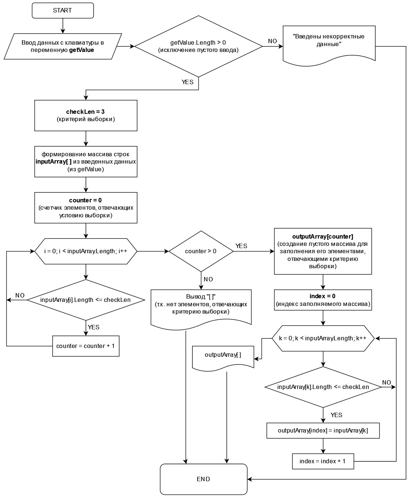

# Контрольная работа по итогу прохождения первого блока обучения

## Задача:
Написать программу, которая из имеющегося массива строк формирует массив из строк, длина которых меньше либо равна 3 символа. Первоначальный массив можно ввести с клавиатуры, либо задать на старте выполнения алгоритма. При решении не рекомендуется пользоваться коллекциями, лучше обойтись исключительно массивами.

*Примеры:*

["hello", "2", "world", ":-)"] -> ["2", ":-)"]

["1234", "1567", "-2", "computer science"] -> ["-2"]

["Russia", "Denmark", "Kazan"] -> []

 

## Решение:

1. Предложение ввести с клавиатуры значения, разделенные запятыми. С помощью метода **IsValidValue** проверить введенные данные.
Присвоить переменной **getValue** (тип _string_) введенные значения. 
Используя метод **GetArrayFromString**, сформировать из введенных данных, содержащихся в переменной **getValue**, массив строк **inputArray**.

2. Задать переменную **counter** (тип _int_) и присвоить ей значение 0, для подсчета элементов первоначального массива, отвечающего заданному условию выборки.

3. Задать переменную **checkLen** (тип _int_) и присвоить ей значение 3, значение которой определяет условие выборки.

4. С помощью цикла _for_ проверить длину строки каждого элемента массива **inputArray** на предмет меньше или равно **checkLen**: при соответствии (истина) счетчик **counter** увеличить на 1.

5. Если счетчик **counter** после выполнения цикла подсчета окажется:
    * равным нулю - вывести в консоль "[ ]", выполнение программы окончено;
    * окажется больше нуля - выполнение программы продолжится.

6. Задать новый пустой массив **outputArray** длиной, равной значению **counter**.

7. Задать переменную **index** (тип _int_) и присвоить ей значение 0, для индексации при заполнении массива **outputArray** элементами массива **inputArray**, отвечающих заданному условию выборки.

8. С помощью цикла _for_ проверить длину строки каждого элемента массива **inputArray** на предмет меньше или равно **checkLen**: при соответствии (истина) элементу массива **outputArray[index]** присвоить такое значение элемента массива **inputArray**, после чего значение переменной **index** увеличить на 1.

9. Вывод в консоль значения всех элементов массива **outputArray**.

* Метод **GetArrayFromString**  
В качестве аргумента передается **getValue** (тип _string_). Данная переменная содержит считанные из консоли данные в виде строки. С помощью _.Split_ строка с запятыми в качестве разделителей разбивается на подстроки, каждая из которых становится отдельным элементом массива. После чего метод возвращает сформированный массив строк.

* Метод **IsValidValue**  
В качестве аргумента передается **getValue** (тип _string_). Данная переменная содержит считанные из консоли данные в виде строки. Метод проверяет длину введенной строки, чтобы она была больше нуля. После чего метод возвращает значение "истина".

 

## Блок-схема решения

